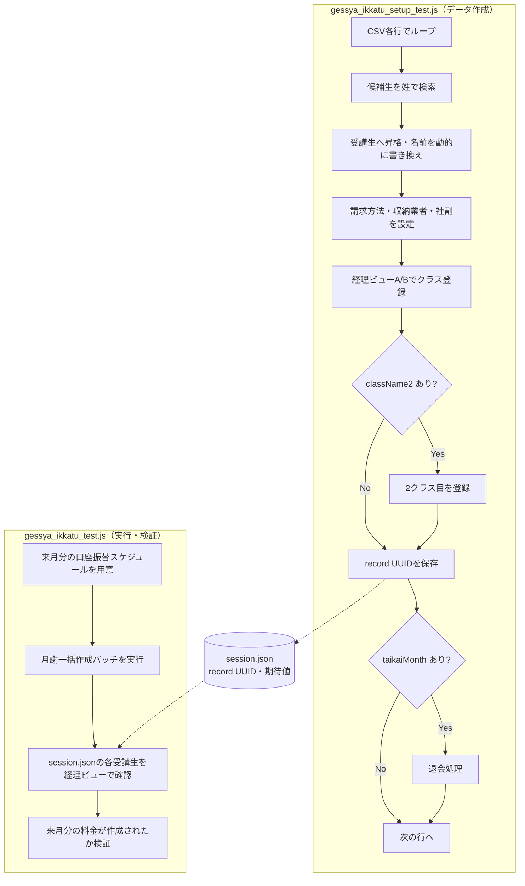

# flow-explain スキル — フローテストのロジック解説＋フローチャート化

flow系 E2E テスト（複数画面・複数ファイルにまたがるシナリオ）のコードを読み解き、
**「このテストは何を・どんな順序で・どういうデータで行うのか」を人間が一読で掴めるように**
散文とフローチャートの2部構成で提供するスキル。

フローテストは処理が `test / FlowPage / CSV` の3ファイルに分散し、さらに setup テストと
本体テストがセッションファイルで連携するなど、コードを上から読むだけでは流れが見えにくい。
その「流れ」を言語化・可視化することそのものに価値がある、という発想のスキル。

---

## このスキルと /shimamura-screen-diagram の違い（最初に確認）

依頼が「画面の遷移」なのか「テストのロジック」なのかで使い分ける。混同すると的外れな出力になる。

| | flow-explain（本スキル） | shimamura-screen-diagram |
|---|---|---|
| 視点 | テストコードのロジック・データ生成の流れ | 一般ユーザーが辿る画面遷移 |
| ノード | 処理ステップ（検索・昇格・保存・バッチ実行・検証…） | 画面（受講生詳細・経理ビュー…） |
| 関心事 | 何のデータをどう作り、どう受け渡し、何を検証するか | どのアイコン→サイドバーからどの画面に行くか |
| 対象 | shimamura / tframe / taskreport の flow系テスト | shimamura の画面 |

「テストデータの作り方」「〇〇テストのロジック」「処理の流れ」＝ **本スキル**。
「画面遷移図」「どの画面からどの画面へ」＝ screen-diagram。

---

## 前提知識：読むべき3点セット

flow系テストは規約上、以下の3ファイルに処理が分かれている（AGENTS.md「ファイルの探し方」参照）。

| 種別 | 場所 | そこから読み取るもの |
|---|---|---|
| テスト本体 | `tests/<product>/flow/*_test.js` | Scenario 構成、Arrange→Act→Assert の骨格、どの FlowPage 関数を呼ぶか、条件分岐（`if (row.xxx)`） |
| FlowPage（Page Object） | `pages/<product>/flow/*FlowPage.js` | 各処理ステップの中身（`I.click`/`I.amOnPage`/`I.selectOption`）、データ加工ロジック、ファイル受け渡し |
| CSV（テストデータ） | `data/<product>/*_data.csv` | 列＝入力パラメータの意味、シナリオ（行）のバリエーション、条件列（空欄なら該当処理をスキップ） |

`<product>` は `shimamura` / `tframe` / `taskreport`。tframe は Page Object が
`pages/tframe/flow/` ではなく `pages/tframe/screens/` にある場合もあるので、テスト本体の
`require(...)` を辿って実体を特定すること。

---

## ワークフロー

### Step 1: 対象テストを特定する

- 依頼文からテストを特定する（例：「月謝一括作成」→ `tests/shimamura/flow/gessya_ikkatu_test.js`）。
  Feature 名や日本語画面名で `grep` すると見つかる（例: `Feature('月謝一括作成')`）。
- **setup テストとの対（つい）を必ず確認する。** `*_setup_test.js` が併存する場合、
  それは本体テストの前提データを作る前工程なので、両方を1つのフローとして扱う。
  対の見つけ方：同じ prefix の `_setup_test.js`、または本体テストのコメント／`Before` が
  「setup による準備が完了していること」を前提としているか。
- 曖昧なら候補を挙げてユーザーに確認する。

### Step 2: 3点セットを読む

テスト本体 → FlowPage → CSV の順で読む。読みながら次を拾う：

- **Scenario / Data の構造**：`Data(csv).Scenario(...)` なら CSV 行ごとに回るデータ駆動。
  `Before` / `BeforeSuite` の前処理（セッションリセット等）も流れの一部。
- **処理ステップの順序**：FlowPage のエクスポート関数を呼ぶ順。`I.say('【○○】...')` の
  ログ文言は処理名の良いヒント。
- **条件分岐**：`if (row.className2)` `if (row.taikaiMonth)` `if (row.discount === '1')` のような
  「CSV の特定列が埋まっているときだけ走る処理」。これはフローチャートの分岐になる。
- **ファイル間の受け渡し**：`SESSION_FILE`（JSON）への書き出し／読み込みなど、setup と本体を
  つなぐ仕組み。`fs.writeFileSync` / `fs.readFileSync` を探す。
- **非自明なデータ生成ロジック**：ここが解説の肝。例：
  - 受講生を新規作成せず「既存の候補生を検索して昇格・改名して流用する」
  - 日付が過去なら実行日に自動補正する（`resolveDynamicDateIfPast`）
  - record UUID を後工程に渡して同名データの取り違えを防ぐ

### Step 3: 散文でロジックを解説する（出力A）

以下の構成で書く。全部埋める必要はなく、そのテストに存在する要素だけ書く。
**冗長な逐条訳ではなく「読み手が驚く・つまずくポイント」を優先して説明する**のがコツ。

```
## <テスト名> のロジック

<1〜2文でこのテストが何をするか>

### 全体の流れ
- 単体テストか、setup + 本体の複数ファイル連携か
- 連携なら受け渡し手段（セッションファイル等）を明示
  （コードブロックで setup → (session.json) → 本体 の関係を図示すると分かりやすい）

### データソース: <CSVパス>
- 1行＝何の単位か（例：受講生1人の1シナリオ）
- 主要な列と役割をテーブルで（条件列は「空欄ならスキップ」と明記）

### テストデータ「作成」の実体
- 非自明ロジックをここで解説（新規作成 vs 既存流用、動的補正、UUID受け渡し 等）
- 条件分岐（どの列が埋まっているとどの処理が増えるか）

### 実行と検証
- Act：主処理（バッチ実行・登録・出力など）と前提（ensureXxx 等）
- Assert：何をどう検証するか
```

### Step 4: Mermaid フローチャートを作成する（出力B）

`flowchart TD` で描く。**画面ではなく処理ステップをノードにする**のがこのスキルの肝。

描画ルール：

- **ファイル／テスト単位で `subgraph`（レーン）に分ける。** setup と本体があるなら
  2レーンにし、間をセッションファイル受け渡しでつなぐ。
- **処理ステップ＝長方形ノード**（`["候補生を姓で検索"]`）。
- **条件分岐＝ひし形**（`{"className2 あり?"}`）。分岐から出る矢印に `Yes` / `No` を付ける。
  「CSV列が埋まっているときだけ走る処理」はこれで表現する。
- **ファイル受け渡し＝シリンダ**（`[("session.json")]`）＋点線 `-.->`。
- **データ駆動ループ**（CSV 各行）は、開始ノードに `["CSV各行でループ"]` と注記するか、
  ループ範囲を subgraph でくくる。
- ノードラベルに `（）` `/` `:` `"` 等の記号が入るときは必ず `["..."]` でダブルクォートする
  （Mermaid パースエラー回避。screen-diagram でも同じ教訓）。

雛形（月謝一括作成を例にした典型形）：



### Step 5: 保存（任意）

- デフォルトは**会話内に散文＋Mermaid を出力**して終わり（「流れを知りたい」用途が主のため）。
- ユーザーが「ドキュメントに残したい」と言った場合のみ、
  `docs/<product>/flow/<テスト名>_flow.md` に保存する。保存する場合は
  ヘッダー（対象テスト・生成日・参照した3ファイル）→ 散文 → Mermaid の順で構成する。
- 保存する場合、AGENTS.md のドキュメント連動ルールは新規 docs 追加なので README ツリー更新
  （`npm run docs:update-readme-map`）の要否をユーザーに確認する。

---

## 品質のポイント

- **逐条訳にしない。** コードを1行ずつ日本語化するのではなく、「全体で何を達成するか」→
  「そのために非自明な工夫が何か」の順で、読み手の理解が進む順序で語る。
- **驚きポイントを先に出す。** 例：「受講生を新規作成していると思いきや、既存候補生を昇格して
  流用している」のような、コードを読まないと気づけない点こそ価値がある。
- **条件分岐を漏らさない。** CSV の条件列（空欄で挙動が変わる列）は、散文とフローチャートの
  両方に必ず反映する。ここがフローテストの複雑さの本体。
- **前提（ハマりどころ）を書く。** `ensureAccountTransferSchedules` のように「これが無いと
  バッチ全体が止まる」種の前提処理は、実務で重要なので明示する。

---

## トラブルシューティング

| 症状 | 原因 | 対処 |
|---|---|---|
| Mermaid がパースエラー | ノードラベルの `（）` `/` `:` `"` をクォートし忘れ | ラベルは `["..."]` で囲む。ラベル内改行は `<br/>` を使う |
| 流れが setup 側だけで完結してしまう | 本体テストとの対を見落としている | Step 1 に戻り `*_setup_test.js` と本体の対を確認する |
| FlowPage が見つからない | tframe は `pages/tframe/screens/` に置かれる場合がある | テスト本体の `require(...)` を辿って実体を特定する |
| 説明が冗長で要点が埋もれる | 逐条訳になっている | Step 3 の「驚きポイント優先」に立ち返り、非自明ロジックを先頭に出す |
| 条件分岐を描き漏らす | CSV の空欄列の意味を見落とした | CSV とテスト本体の `if (row.xxx)` を突き合わせ、条件列を洗い出す |
