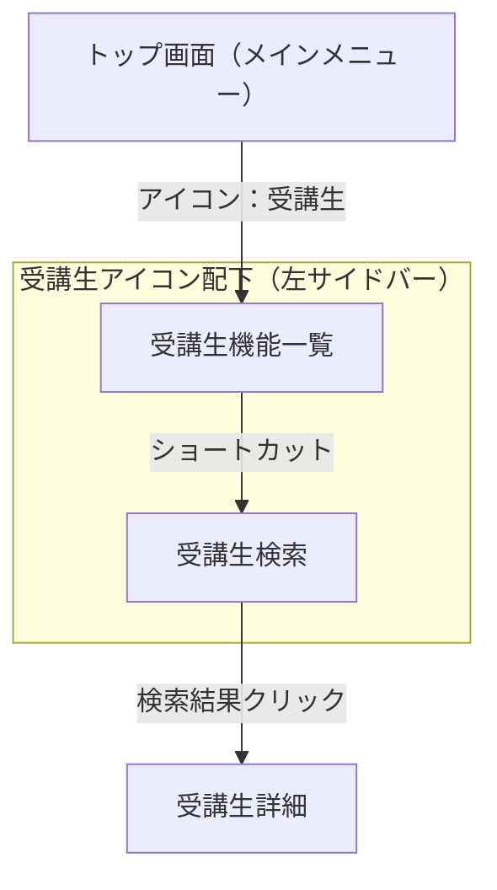

# shimamura-screen-diagram スキル — 画面遷移図の作成・更新

shimamura の E2E テストコードを解析して、**一般ユーザーが実際に操作する画面遷移**を
Mermaid 図として可視化するスキル。ゼロから手作業で画面を洗い出すのではなく、
既存のテスト資産（`sideMenus.js` / `pages/shimamura/flow/*.js` / `tests/shimamura/flow/*.js`）
から遷移情報を抽出して組み立てる。

---

## 描画の3原則（必ず守ること）

過去の作成で得た教訓。これを外すと「わかりにくい図」になる。

1. **1画面＝1ノード**
   同じ画面（例：受講生詳細）は複数のテストフローから訪問されるが、フローごとに
   ノードを分けない。1つのノードに統合し、矢印ラベルでどのフロー由来かを示す
   （例: `[A/C]` のように略記、または凡例テーブルで対応させる）。

2. **実際のユーザー操作経路で描く（直URL遷移は使わない）**
   テストコードは `SHIMAMURA_NAV` 環境変数や `I.amOnPage(直URL)` で近道することが多いが、
   実際のユーザーは URL を直接入力しない。図は必ず
   `トップ画面 → アイコンクリック → （折りたたみ展開が必要なら展開）→ 左サイドバーのショートカット → 画面`
   というクリック経路（`sideMenus.js` の `moduleUrl` / `collapseToggle` / `shortcut` に対応）で描く。

3. **経路が断定できない箇所は推測せず「要確認」にする**
   コード上 `directUrl` しかなく、実際にどのアイコン／サイドバー項目から辿るか
   特定できない画面は、点線で仮配置した上で「要確認リスト」に挙げてユーザーに確認する。
   ユーザーだけが知っている実際の画面操作を、憶測で断定しないこと。

---

## 前提知識：参照すべきファイル

| 目的 | 参照先 |
|---|---|
| 画面カタログ（アイコン/折りたたみ/ショートカットの定義） | `pages/shimamura/_common/sideMenus.js` |
| 業務フローの遷移順序 | `pages/shimamura/flow/*.js`（各 FlowPage） |
| FlowPage を使わない単発画面フロー（Pattern B） | `tests/shimamura/flow/*.js` の中で `pages/shimamura/flow` を require していないもの |
| どのテストがどの FlowPage を使っているか | `tests/shimamura/flow/*.js` の `require('../../../pages/shimamura/flow/...')` |
| 既存の画面遷移図（更新時の土台） | `docs/shimamura/screen_navigation_diagram.md` |

---

## ワークフロー

### Step 1: 対象範囲を確認する

- 「shimamura 全体」か「特定のフロー（例：月謝一括作成だけ）」か、依頼文から判断する。
  曖昧な場合はユーザーに確認する。
- 全体の場合は Step 2 へ、特定フローのみの場合は該当 FlowPage / テストファイルだけ読めばよい。

### Step 2: 画面カタログを読む

`pages/shimamura/_common/sideMenus.js` を読み、各エントリから以下を抽出する：

```js
{
  directUrl,       // テスト用の近道（図には使わない）
  moduleUrl,       // クリックで辿り着く「モジュールTOP（アイコン先）」
  collapseToggle,  // { icon_id, menuname } があれば折りたたみグループ経由
  shortcut,        // サイドバーのリンクテキスト
}
```

- `moduleUrl` の `module=` パラメータでアイコン（受講生・コース・講師・経理・顧客など）をグルーピングする。
- `collapseToggle` があるものは「〇〇グループを展開してからショートカットをクリック」という2段階の矢印にする。
- `directUrl` のみ（`moduleUrl` がない）のエントリは Step 5 で「要確認」扱いにする。

### Step 3: 対象フローのコードを読む

`tests/shimamura/flow/*.js` を一覧し、各テストが `require` している
`pages/shimamura/flow/*FlowPage.js` を特定する。

- FlowPage がある場合：エクスポートされている関数を上から順に読み、
  `I.click` / `I.amOnPage` / `logScreenUrl` の呼び出し順で画面遷移を追う。
  `I.say('【○○】...')` のログ文言は画面名・操作名のヒントになるので活用する。
- FlowPage がない場合（Pattern B・1画面完結）：テストファイル自体を読む。
  多くは「URL直遷移 → フォーム入力 → 保存」で完結する単純な画面。

### Step 4: 画面ノードを統合する

同じ画面が複数のフローに登場する場合（典型例：受講生詳細、受講生編集、
受講生登録・経理ビュー（個人））は、フローをまたいで1つのノードにまとめる。
判断基準：**URL の module/action が同じ、または `logScreenUrl` に渡している画面名が同じ**なら統合する。

### Step 5: 経路を実線／点線に分類する

| 情報源 | 扱い |
|---|---|
| `moduleUrl` + `shortcut`（`collapseToggle` の有無問わず） | 実線（実際にアイコン→サイドバーで辿れる） |
| FlowPage 内の画面内操作（クリック・保存・タブ切替など） | 実線 |
| `directUrl` のみで `moduleUrl` が存在しないエントリ | 点線＋「要確認リスト」に追加 |
| コードが直URL遷移をしているが、実際は画面内タブ切替等で代替できそうなもの | 実線に読み替える（例：講師の経理タブは「講師詳細画面内でタブ切替」と表現し、直URLの実装詳細は図に出さない） |

### Step 6: Mermaid 図を作成する

- アイコンごとに `subgraph` を作り、その中に「モジュールTOP＋直下のショートカット画面」だけを入れる
  （Level 1〜2 まで）。業務フローの深い遷移（Level 3以降）は subgraph の外に出し、
  Level 2 のノードから矢印でつなぐ。
- 矢印ラベルには操作内容を書く：直接ショートカットは `"ショートカット"`、
  折りたたみが必要なものは `"「〇〇」展開→ショートカット"` のように書く。
- ノードラベルに `（）` `/` 等の記号が入る場合は必ず `["..."]` でダブルクォートする。
- 点線は `-.->|"ラベル"|` を使う。

雛形（実例は `docs/shimamura/screen_navigation_diagram.md` を参照）：



### Step 7: 保存する

- 保存先：`docs/shimamura/screen_navigation_diagram.md`
  （既存ファイルがあれば上書き更新。特定フローのみの依頼で新規ファイルにしたい場合はユーザーに確認する）
- 構成：ヘッダー（生成日・生成方法・範囲の注意）→ Mermaid 図 → 図の読み方 →
  要確認リスト（あれば）→ 参照元ファイル一覧（テーブル）→ 制約・今後の拡張

### Step 8: 要確認リストを提示する

`directUrl` のみで実際の経路が特定できなかった画面は、箇条書きでユーザーに問いかける。
回答が得られたら該当箇所を実線に修正し、要確認リストから削除する。

---

## 更新時（差分更新）のポイント

新しい FlowPage / テストが追加された場合：

1. 追加されたテストが `require` している FlowPage を特定する（Step 3 と同じ）。
2. 既存の `docs/shimamura/screen_navigation_diagram.md` を読み、
   新しい画面が既存ノードと重複しないか確認する（Step 4 の統合ルールを適用）。
3. 新規ノード・エッジのみを Mermaid コードに追記する。全体を書き直さない。
4. 参照元ファイルのテーブルに1行追加する。

---

## トラブルシューティング

| 症状 | 原因 | 対処 |
|---|---|---|
| Mermaid がパースエラーになる | ノードラベルの `（）` `/` `"` をクォートし忘れ | ラベルは必ず `["..."]` で囲む |
| 図がノードだらけで読みにくい | フロー単位で subgraph を作ってしまい、同じ画面が重複している | Step 4 に戻り、アイコン単位の subgraph に組み替える |
| 点線だらけになる | `sideMenus.js` に載っていない画面が多い（新しいモジュール） | ユーザーに実際の画面操作を確認してから実線にする。憶測で実線にしない |
| どのテストがどの画面を使っているか分からない | FlowPage を経由しない直書きテストがある | `tests/shimamura/flow/*.js` を grep して `pages/shimamura/flow` を require していないファイルを個別に読む |
