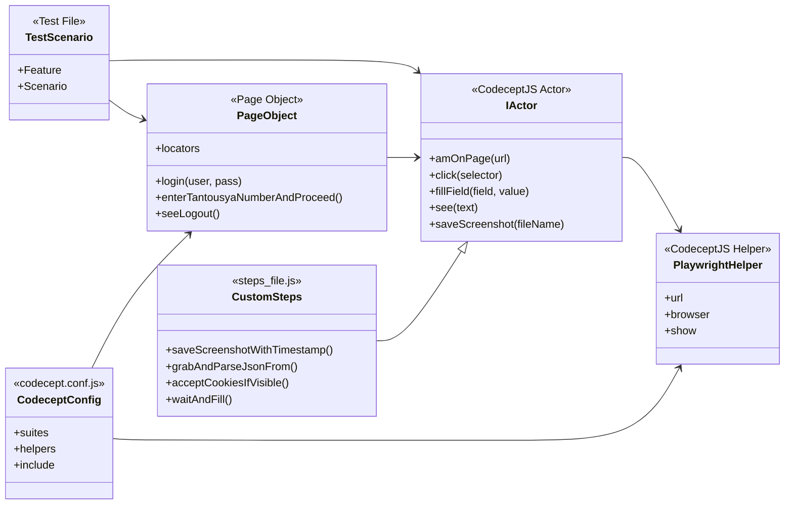

```mermaid
classDiagram
    direction LR

    class TestScenario {
        <<Test File>>
        +Feature
        +Scenario
    }

    class IActor {
        <<CodeceptJS Actor>>
        +amOnPage(url)
        +click(selector)
        +fillField(field, value)
        +see(text)
        +saveScreenshot(fileName)
    }

    class CustomSteps {
        <<steps_file.js>>
        +saveScreenshotWithTimestamp()
        +grabAndParseJsonFrom()
        +acceptCookiesIfVisible()
        +waitAndFill()
    }

    class PageObject {
        <<Page Object>>
        +locators
        +login(user, pass)
        +enterTantousyaNumberAndProceed()
        +seeLogout()
    }

    class PlaywrightHelper {
        <<CodeceptJS Helper>>
        +url
        +browser
        +show
    }

    class CodeceptConfig {
        <<codecept.conf.js>>
        +suites
        +helpers
        +include
    }

    TestScenario --> PageObject
    TestScenario --> IActor
    PageObject   --> IActor
    CustomSteps  --|> IActor
    IActor       --> PlaywrightHelper
    CodeceptConfig --> PlaywrightHelper
    CodeceptConfig --> PageObject
```