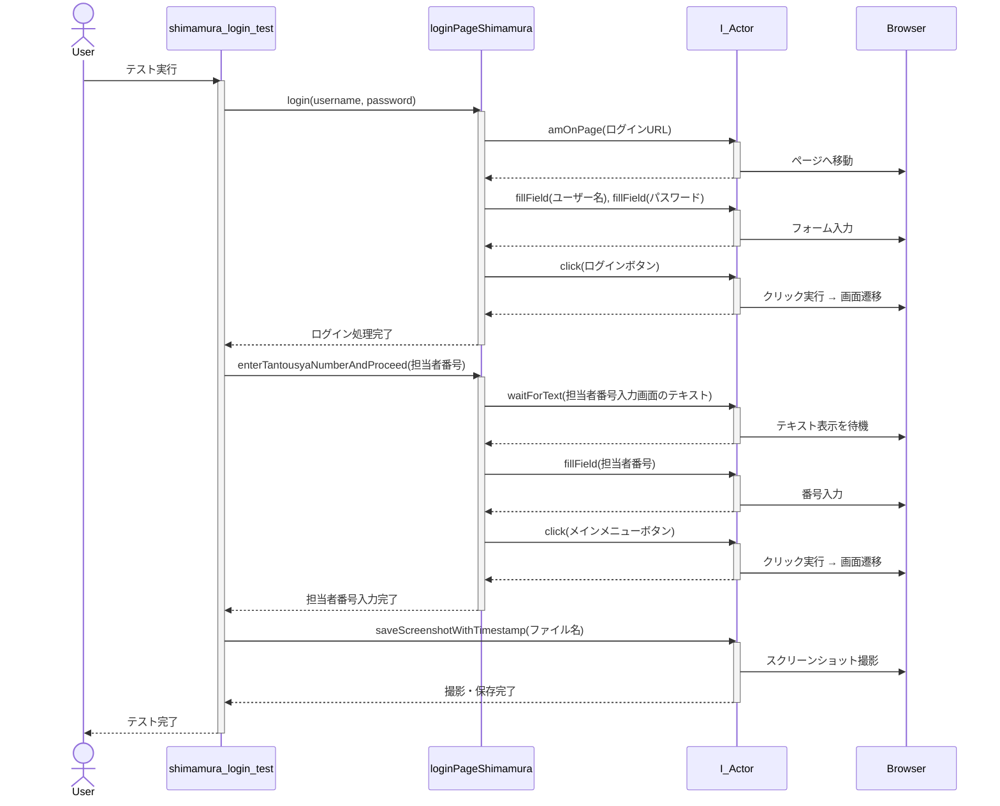

```mermaid
sequenceDiagram
    actor User
    participant Test as shimamura_login_test
    participant PO as loginPageShimamura
    participant I as I_Actor
    participant Browser

    User->>Test: テスト実行
    activate Test

    Test->>PO: login(username, password)
    activate PO
    PO->>I: amOnPage(ログインURL)
    activate I
    I->>Browser: ページへ移動
    I-->>PO:
    deactivate I
    PO->>I: fillField(ユーザー名), fillField(パスワード)
    activate I
    I->>Browser: フォーム入力
    I-->>PO:
    deactivate I
    PO->>I: click(ログインボタン)
    activate I
    I->>Browser: クリック実行 → 画面遷移
    I-->>PO:
    deactivate I
    PO-->>Test: ログイン処理完了
    deactivate PO

    Test->>PO: enterTantousyaNumberAndProceed(担当者番号)
    activate PO
    PO->>I: waitForText(担当者番号入力画面のテキスト)
    activate I
    I->>Browser: テキスト表示を待機
    I-->>PO:
    deactivate I
    PO->>I: fillField(担当者番号)
    activate I
    I->>Browser: 番号入力
    I-->>PO:
    deactivate I
    PO->>I: click(メインメニューボタン)
    activate I
    I->>Browser: クリック実行 → 画面遷移
    I-->>PO:
    deactivate I
    PO-->>Test: 担当者番号入力完了
    deactivate PO

    Test->>I: saveScreenshotWithTimestamp(ファイル名)
    activate I
    I->>Browser: スクリーンショット撮影
    I-->>Test: 撮影・保存完了
    deactivate I

    Test-->>User: テスト完了
    deactivate Test
```
