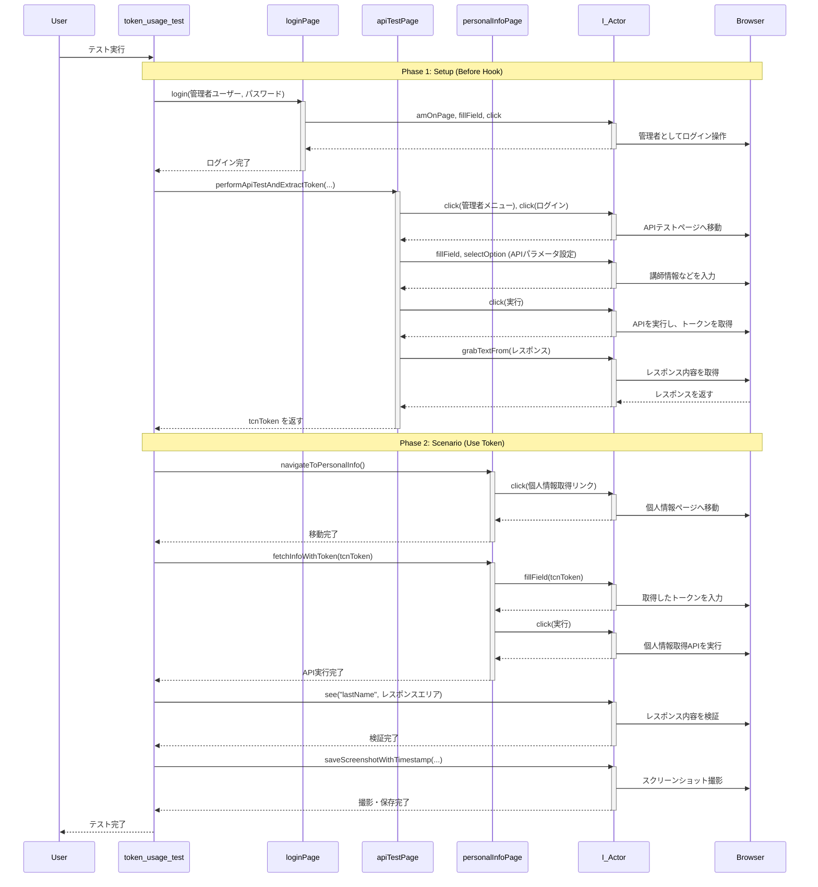

```mermaid
sequenceDiagram
    participant User
    participant Test as token_usage_test
    participant LP as loginPage
    participant ATP as apiTestPage
    participant PIP as personalInfoPage
    participant I as I_Actor
    participant Browser

    User->>Test: テスト実行

    Note over Test, Browser: Phase 1: Setup (Before Hook)

    Test->>LP: login(管理者ユーザー, パスワード)
    activate LP
    LP->>I: amOnPage, fillField, click
    activate I
    I->>Browser: 管理者としてログイン操作
    I-->>LP:
    deactivate I
    LP-->>Test: ログイン完了
    deactivate LP

    Test->>ATP: performApiTestAndExtractToken(...)
    activate ATP
    ATP->>I: click(管理者メニュー), click(ログイン)
    activate I
    I->>Browser: APIテストページへ移動
    I-->>ATP:
    deactivate I
    ATP->>I: fillField, selectOption (APIパラメータ設定)
    activate I
    I->>Browser: 講師情報などを入力
    I-->>ATP:
    deactivate I
    ATP->>I: click(実行)
    activate I
    I->>Browser: APIを実行し、トークンを取得
    I-->>ATP:
    deactivate I
    ATP->>I: grabTextFrom(レスポンス)
    activate I
    I->>Browser: レスポンス内容を取得
    Browser-->>I: レスポンスを返す
    I-->>ATP:
    deactivate I
    ATP-->>Test: tcnToken を返す
    deactivate ATP

    Note over Test, Browser: Phase 2: Scenario (Use Token)

    Test->>PIP: navigateToPersonalInfo()
    activate PIP
    PIP->>I: click(個人情報取得リンク)
    activate I
    I->>Browser: 個人情報ページへ移動
    I-->>PIP:
    deactivate I
    PIP-->>Test: 移動完了
    deactivate PIP

    Test->>PIP: fetchInfoWithToken(tcnToken)
    activate PIP
    PIP->>I: fillField(tcnToken)
    activate I
    I->>Browser: 取得したトークンを入力
    I-->>PIP:
    deactivate I
    PIP->>I: click(実行)
    activate I
    I->>Browser: 個人情報取得APIを実行
    I-->>PIP:
    deactivate I
    PIP-->>Test: API実行完了
    deactivate PIP

    Test->>I: see("lastName", レスポンスエリア)
    activate I
    I->>Browser: レスポンス内容を検証
    I-->>Test: 検証完了
    deactivate I

    Test->>I: saveScreenshotWithTimestamp(...)
    activate I
    I->>Browser: スクリーンショット撮影
    I-->>Test: 撮影・保存完了
    deactivate I

    Test-->>User: テスト完了
```