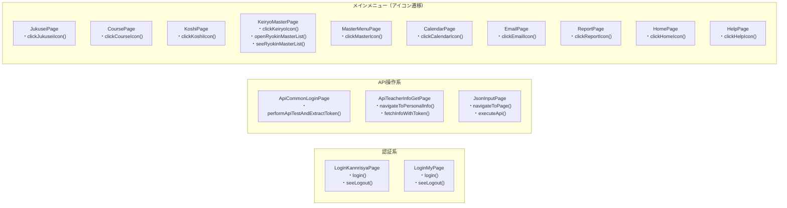

# Mermaid 構造図 - tframe Page Objects & Tests
> 生成日: 2026-03-31
> 対象: tests/tframe/ と pages/tframe/ の構成・依存関係

---

## 【図1】公開メソッド グループ図

この図の読み方
- `Auth`：ログイン・ログアウト確認を担うPage Object群。全テストの起点。
- `API`：管理画面API操作・トークン取得・JSON実行を担う特殊Page Object群。
- `Menu`：ログイン後のメインメニュー各アイコン操作を担うPage Object群。経理のみサブメニューまで実装済み、他はスケルトン。

---

## 【図2】テスト ↔ Page Object 依存関係 詳細図

```mermaid
graph TD
  subgraph Tests["tests/tframe/"]
    T1["login_test.js\n@admin / @student"]
    T2["mypage_login_test.js"]
    T3["keiryo_master_test.js\n@admin"]
    T4["navigation_after_login_test.js"]
    T5["navigation_after_login_student_test.js"]
    T6["token_usage_test.js"]
    T7["get_personal_info_api_test.js"]
    T8["96-60_teacher_payment_report_test.js"]
    T9["jukusei_test.js (skeleton)"]
    T10["course_test.js (skeleton)"]
    T11["koshi_test.js (skeleton)"]
    T12["master_menu_test.js (skeleton)"]
    T13["calendar_test.js (skeleton)"]
    T14["email_test.js (skeleton)"]
    T15["report_test.js (skeleton)"]
    T16["home_test.js (skeleton)"]
    T17["help_test.js (skeleton)"]
  end

  subgraph Pages["pages/tframe/"]
    P1["LoginKannrisyaPage"]
    P2["LoginMyPage"]
    P3["ApiCommonLoginPage"]
    P4["ApiTeacherInfoGetPage"]
    P5["JsonInputPage"]
    P6["KeiryoMasterPage"]
    P7["JukuseiPage"]
    P8["CoursePage"]
    P9["KoshiPage"]
    P10["MasterMenuPage"]
    P11["CalendarPage"]
    P12["EmailPage"]
    P13["ReportPage"]
    P14["HomePage"]
    P15["HelpPage"]
  end

  T1 --> P1
  T2 --> P2
  T3 --> P1 & P6
  T4 --> P1
  T5 --> P2
  T6 --> P3
  T7 --> P3 & P4
  T8 --> P1 & P5
  T9 --> P1 & P7
  T10 --> P1 & P8
  T11 --> P1 & P9
  T12 --> P1 & P10
  T13 --> P1 & P11
  T14 --> P1 & P12
  T15 --> P1 & P13
  T16 --> P1 & P14
  T17 --> P1 & P15
```

主要な処理フロー
- ほぼ全テストが `LoginKannrisyaPage.login()` を起点にする（認証の共通依存）
- `KeiryoMasterPage` のみサブメニューまで実装済み、他のメニューPageはスケルトン
- API系テスト（token_usage / get_personal_info）は `ApiCommonLoginPage` でトークンを取得し `ApiTeacherInfoGetPage` に渡す2段構成
- `LoginMyPage` は講師/受講生のマイページ用で管理者ログインとは独立
