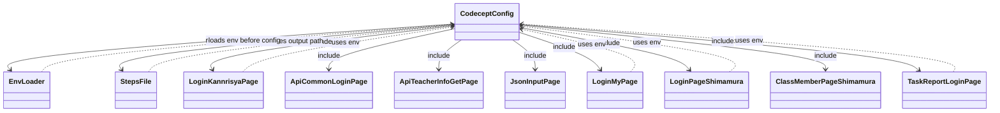
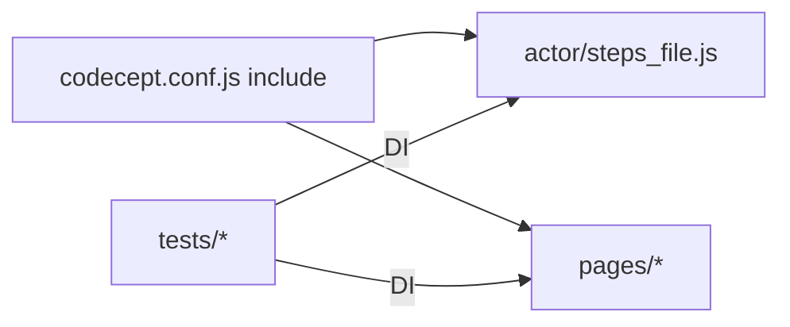

# CodeceptJS JS関係図 (Mermaid)

## クラス図（主要なJSモジュールと依存関係）

```mermaid
classDiagram
  class CodeceptConfig
  class EnvLoader
  class StepsFile
  class LoginKannrisyaPage
  class ApiCommonLoginPage
  class ApiTeacherInfoGetPage
  class JsonInputPage
  class LoginMyPage
  class LoginPageShimamura
  class ClassMemberPageShimamura
  class TaskReportLoginPage

  CodeceptConfig --> EnvLoader : require
  CodeceptConfig --> StepsFile : include I
  CodeceptConfig --> LoginKannrisyaPage : include
  CodeceptConfig --> ApiCommonLoginPage : include
  CodeceptConfig --> ApiTeacherInfoGetPage : include
  CodeceptConfig --> JsonInputPage : include
  CodeceptConfig --> LoginMyPage : include
  CodeceptConfig --> LoginPageShimamura : include
  CodeceptConfig --> ClassMemberPageShimamura : include
  CodeceptConfig --> TaskReportLoginPage : include

  LoginKannrisyaPage ..> CodeceptConfig : uses env
  LoginMyPage ..> CodeceptConfig : uses env
  LoginPageShimamura ..> CodeceptConfig : uses env
  TaskReportLoginPage ..> CodeceptConfig : uses env

  StepsFile ..> CodeceptConfig : uses output path
  EnvLoader ..> CodeceptConfig : loads env before config
```

## テスト -> ページオブジェクト/補助 -> データ の関係

```mermaid
flowchart TD
  subgraph TFRAME[tests/tframe]
    T1[navigation_after_login_test.js]
    T2[navigation_after_login_student_test.js]
    T3[token_usage_test.js]
    T4[96-60_teacher_payment_report_test.js]
    T5[login_test.js]
    T6[mypage_login_test.js]
  end

  subgraph SHIMAMURA[tests/shimamura]
    S1[shimamura_login_test.js]
    S2[shimamura_class_member_registration_test.js]
    S3[syokai_touroku.js]
    S4[taikai.js]
  end

  subgraph TASKREPORT[tests/Taskreport]
    R1[taskreport_sample_test.js]
  end

  subgraph PAGES[pages/*]
    P1[LoginKannrisyaPage.js]
    P2[ApiCommonLoginPage.js]
    P3[ApiTeacherInfoGetPage.js]
    P4[JsonInputPage.js]
    P5[LoginMyPage.js]
    P6[LoginPage.js]
    P7[ClassMemberPage.js]
    P8[TaskReportLoginPage.js]
  end

  subgraph SUPPORT[support/*]
    C1[steps_file.js]
    C2[envLoader.js]
  end

  subgraph DATA[data/*]
    D1[teacherPaymentReportParams.js]
    D2[syokai_touroku_data.csv]
    D3[syokai_touroku_data_<profile>.csv]
    D4[taikai_testdata.csv]
  end

  T1 --> P1
  T1 --> P2
  T2 --> P1
  T2 --> P2
  T3 --> P1
  T3 --> P2
  T3 --> P3
  T4 --> P1
  T4 --> P2
  T4 --> P4
  T4 --> D1
  T5 --> P1
  T6 --> P5

  S1 --> P6
  S2 --> P6
  S2 --> P7
  S3 --> P6
  S3 --> P7
  S3 --> D2
  S3 --> D3
  S4 --> P6
  S4 --> P7
  S4 --> D4

  R1 --> P8

  T1 --> C1
  T2 --> C1
  T3 --> C1
  T4 --> C1
  S1 --> C1
  S2 --> C1
  S3 --> C1
  S4 --> C1
  R1 --> C1

  C2 --> T1
  C2 --> T2
  C2 --> T3
  C2 --> T4
  C2 --> T5
  C2 --> T6
  C2 --> S1
  C2 --> S2
  C2 --> S3
  C2 --> S4
  C2 --> R1
```

## 補足: CodeceptJS DI（inject）の関係

```mermaid
flowchart LR
  Config[codecept.conf.js include] --> I[actor/steps_file.js]
  Config --> PageObjects[pages/*]
  Tests[tests/*] -->|DI| PageObjects
  Tests -->|DI| I
```
