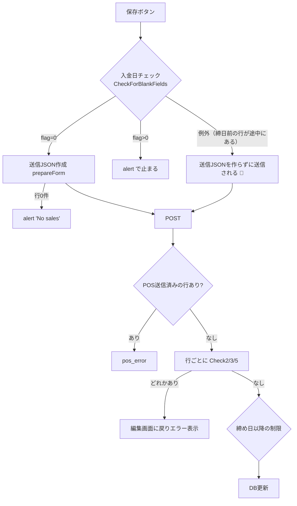

料金明細 編集画面（入金入力モード）で「保存」したときに、どの条件でどのエラーになるかをまとめた資料です。
設計書が無いため、**画面の JS を実際に読んだ結果**と、**共有された資料（サーバー側 `Save_shimamura.php` の要約）**を突き合わせて作っています。
サーバー側のソースは未確認なので、各行に「根拠」を付けています。

状態: 進行中（2026-10 開始・#279）

| 根拠の記号 | 意味 |
|---|---|
| 🟢 観察 | testgcp で E2E の観察ランナーを動かして確かめた（保存はしていない） |
| 🔵 コード | 画面の HTML/JS（2026-10-01 取得）を読んで確かめた |
| 🟡 資料 | 共有資料の記述のみ。PHP ソースは未確認（要確認） |

---

## ① 画面の概要

- 画面: `index.php?module=SalesGroup&action=EditView&record=<明細番号>&transfer=1&salesno_contactid=<受講生番号>`
  （経理ビュー個人の明細番号リンクから遷移）
- 1行 = 同じ明細番号（`salesno`）を持つ入出金（`sms_transaction`）1件。
  経理ビューで複数の料金を一度に確定すると、同じ明細番号の行が2行以上できる
  （例: 分類「スクール」のクラスなら月謝と運営管理費が同じ明細番号になる）。
- 上段: 入金日・入金額・手数料・支払方法を入れ、「バランスを入力」（`CopyBalance`）→「入金分配」（`DivideTransfer`）で各行に配る。
- 保存: `OnClickSave()` → 入金日チェック（`CheckForBlankFields()`）→ 送信 JSON 作成（`prepareForm()` → hidden `sales_details`）→ POST → サーバーのチェック → 問題なければ DB 更新。

### 行の描き方は2種類ある 🔵

| 行の種類 | 条件 | 画面 | 送信 JSON に入る値 |
|---|---|---|---|
| 入力欄の行 | 入金日が空、または 入金日 ≥ 締日 | `t_date_0` などの入力欄 | 保存の瞬間の入力欄の値 |
| **文字表示の行**（締日前の行） | 入金日あり かつ **入金日 < 締日**（`transaction_array.shimebi`） | 文字だけ。入力欄なし | DB の値。ただし**支払方法と、DB で数値の 0 の項目（バランス等）は空文字** |

締日は画面 HTML の `transaction_array` に埋め込まれている（testgcp は `2001-01-01`＝実質なし）。
**日付が進んで締日を越えると、同じ行が「入力欄の行」から「文字表示の行」に変わる。**

---

## ② 保存時のチェックの順番



---

## ③ 画面側（JS）のチェック 🔵

| # | 条件 | 結果 |
|---|---|---|
| J1 | 入力欄の行で、入金日が `yyyy-mm-dd` でない／存在しない日付 | alert「入金日の入力形式が不正です。」で止まる |
| J2 | 入力欄の行で、入金額 > 0 なのに入金日が空 | alert「入金日を入力してください。」で止まる |
| J3 | J1 と J2 が両方 | 2つ続けて alert、止まる |
| J4 | 行が0件 | alert「No sales」、止まる |
| J5 | **文字表示の行より後ろに入力欄の行がある**（例: 1行目=締日前の6月、2行目=7月） | `CheckForBlankFields()` が存在しない `#t_date_0` を読んで例外になる。保存ボタンの onclick が途中で落ちるため**送信は止まらず**、`prepareForm()` が呼ばれないまま POST される（`sales_details` が空） |
| J6 | 分配・入力の結果、バランスがマイナス | alert「バランスがマイナスに…」「入金額が入金予定額より多く…」。**OK で先に進める（止まらない）** 🟢 |

J1〜J3 は**入力欄のある行だけ**が対象。ループは「最後の入力欄の行の番号」まで回るので、
文字表示の行が最後にあるときは J5 にならない 🟢（締日を模擬して確認）。

---

## ④ サーバー側のチェック（1行ずつ判定）🟡

比較6項目: 入金予定額 `in_amount`・締切日 `due_date`・入金日 `t_date`・入金額 `actual_in_amount`・手数料 `commission`・支払方法 `payment_type`。
「差分あり」＝送信 JSON の値が DB の値と違う項目が1つ以上ある。

### 条件

| ID | 条件 |
|---|---|
| P | その行が POS 送信済み（`pos_status=1` かつ `access_token` あり） |
| D | DB 上で入金済み（`actual_in_amount≠0` または `t_date≠''` または `payment_type≠''`） |
| X | 比較6項目に差分あり |
| T | 送信値の入金日が空 |
| S | 送信値の入金日か入金額に値がある |
| M | 送信値の支払方法が空 |

### デシジョンテーブル（1行分）

`-` = どちらでもよい。

| ルール | P | D | X | T | S | M | 結果 | 例 |
|---|---|---|---|---|---|---|---|---|
| S1 | Y | - | - | - | - | - | **pos_error**（明細全体を保存しない） | POS 入金結果の反映待ち |
| S2 | N | Y | N | - | - | - | 問題なし | 入金済みの行に触れていない |
| S3 | N | Y | Y | N | Y | N | **Check2** 既に入金済み | 入金済みの行の金額・日付を変えた |
| S4 | N | Y | Y | N | Y | Y | **Check2 ＋ Check3** | 締日前の文字表示行（支払方法が空で送られる） |
| S5 | N | Y | Y | Y | - | - | **Check2 ＋ Check5**（S かつ M なら Check3 も） | 入金済みの行の入金日を消した |
| S6 | N | N | N | - | N | - | 問題なし | 未入金の行に触れていない |
| S7 | N | N | Y | N | Y | N | 問題なし（入金として保存） | 普通の入金 |
| S8 | N | N | Y | N | Y | Y | **Check3** 支払方法を設定してください | 支払方法を空にして入金 |
| S9 | N | N | Y | Y | Y | N | **Check5** 入金日は必須 | 入金額だけ入れた（J2 をすり抜けた場合） |
| S10 | N | N | Y | Y | Y | Y | **Check3 ＋ Check5** | |
| S11 | N | N | Y | Y | N | - | **Check5** 入金日は必須 | 締切日だけ変えた |

- 明細の**どれか1行でも** Check2/3/5 に当たれば、明細全体が保存されない（エラーは行ごとに料金名付きで並ぶ）🟡
- 全行が「問題なし」のときだけ、締め日以降の制限（`shimebi_restrict_keiri_processing`）を見て DB 更新 🟡
- 要確認 🟡: S の「入金額に値がある」が `0` を含むか（`''` と `'0'` を区別するか）。P の行があるとき Check2〜5 も評価されるか。J5 で `sales_details` が空のまま届いたとき、サーバーが各行をどう扱うか。

---

## ⑤ 差分（X）が生まれる原因 — ユーザーが触っていないのに差分になる経路

Check2 は「入金済みの行に差分がある」で起きる。ユーザーが触っていなくても、画面の作りで差分が生まれる経路がある。

| # | 経路 | 起きる条件 | 差分になる項目 | 根拠 |
|---|---|---|---|---|
| E | **締日前の行は支払方法が空で送られる** | 入金日 < 締日の入金済みの行がある（日をまたぐと起きうる） | `payment_type`: DB値 → `''` | 🟢 締日を模擬して確認 |
| D | **締日前の行が途中にあると、送信 JSON を作らずに送信される**（J5） | 締日前の行より後ろに入力欄の行がある | 全項目（`sales_details` が空） | 🔵 |
| A | 支払方法の選択肢が「現金」「空」だけ。**カード等で入金済みの行**は先頭の「現金」が選ばれて表示される | 現金以外で入金済み、かつ入力欄の行 | `payment_type`: credit 等 → `cash` | 🔵（未観察。テストデータが作れない） |
| B | 入金分配の余りが、**入金済みかどうかに関係なく最後の行**の入金額に足される | 上段の入金額 > 未入金の合計 | `actual_in_amount` | 🟢 1000 を分配して確認 |
| C | 締切日が同じグループに過入金（バランスがマイナス）の行があると、その行の入金日・支払方法・入金額が上段の値で上書きされる | 過入金の行がある状態で分配 | `t_date` `payment_type` `actual_in_amount` | 🔵 |
| F | DB の締切日が空文字だと、表示で「今日＋3日」が入る | `due_date=''` | `due_date` | 🔵（`null` なら空のまま） |

**分配しない普通の操作では、入力欄の行の「画面表示」と「送信 JSON」はずれない**（`sales_arr` は入力欄そのものを持ち、保存時に `.value` を読み直すため）🔵。
一部入金の行（入金日あり・バランス残あり）は分配の対象外（入金日が空の行にだけ配る）🔵。

---

## ⑥ 共有されたデシジョンテーブル（R1〜R10）の確認結果

結論: **そのままでは使えない。** ④⑤ で作り直した。

| 指摘 | 内容 |
|---|---|
| 1. 原因の置き方 | R9（障害発症）は「一括分配を実行（C1=Y）」で行1に差分が出る（`Y*`）としているが、入金分配は**入金済みでバランス 0 の行には触れない** 🔵🟢。問い合わせの症状は分配の有無ではなく、⑤-E/D（締日前の行）で説明がつく。R10（分配しない＝正常回避）も、締日を越えていれば同じく失敗する見込み |
| 2. 起こりえないルール | R4・R5・R8 は「DB 未入金・差分なし・入金日あり」の組み合わせ。DB 未入金なら入金日は空なので、差分なしで入金日ありにはならない |
| 3. 結果の誤り | R8 は行2が「差分なし（C9=N）」なのに Check5（A7）を出している。Check5 は差分があるときだけ |
| 4. 条件の抜け | Check3 の条件「入金日か入金額に値がある」が条件欄に無い（R4・R5 はここが無いと判定できない）。締日前の行（文字表示）という画面側の状態が無い |
| 5. 表の形 | サーバーのチェックは1行ずつ独立なので、行1×行2の掛け合わせより「1行分の表（④）＋明細全体の規則」の方が抜けなく書ける。再現ケース（障害発症／正常回避）は仕様の表と分け、⑦ の再現シナリオにした |
| 6. 画面側チェック | J1〜J6（特に J5: 例外で送信 JSON が作られない）が無い |

---

## ⑦ 問い合わせとの対応

> 同一の料金明細番号で入金済みの項目があった場合、日をまたぐと入金記入画面で入金処理できない。
> 例: 6・7月分が同じ明細番号で、6月分のみカード請求済み → バランスを入力＞入金分配＞保存 で入金済みエラー

| 段階 | 起きること | 根拠 |
|---|---|---|
| 当日 | 6月分の入金日 ≥ 締日なので入力欄の行。差分が出なければ保存できる（カードなら ⑤-A で差分が出うる） | 🔵 |
| 日をまたぐ（締日が6月分の入金日を越える） | 6月分が**文字表示の行**になる | 🔵 |
| 保存 | 1行目が文字表示・2行目が入力欄なので **J5**：入金日チェックが例外 → 送信 JSON を作らずに POST | 🔵 |
| サーバー | 6月分（入金済み）に差分あり → **Check2「既に入金済みのため、入金処理は不可です（料金名:6月分）」** | 🟡（J5 で空 JSON が届いた場合の扱いは要確認。E の経路でも Check2） |
| 「以前はできていた」 | 支払方法の空欄処理（`Clark 93812` コメント）と Check2（TR 93812 / 92110）が後から入ったため、と考えられる | 🔵（JS のコメント）＋🟡 |

予想される確認結果（未確認）:
- 分配せず7月分を手で入力して保存しても、同じエラーになる（分配は原因ではない）
- UAT2 の画面ソースで `"shimebi":"…"` が6月分の入金日より後になっている

### 再現のしかた（testgcp・保存しない）

締日の設定が無い環境では、観察ランナーで締日を模擬する（ブラウザ側で応答の締日だけ書き換える。サーバーは変わらない）。

```
SALESNO=<明細番号> SALESNO_CONTACT_ID=<受講生番号> OBS_SIMULATE_SHIMEBI=<入金済み行の入金日の翌日> \
  npx codeceptjs run ./tests/shimamura/util/sales_group_transfer_observe.js --profile shimamura.testgcp
```

出力（`output/sales_group_transfer_observe/*.json`）の `previewAfter.checkError`（J5 の例外）、`predictions`（Check2/3/5 の予測）を見る。
J5 を観察するには、**入金済みの行が前・未入金の行が後ろ**に並ぶ明細が要る（データ作成は別 Issue）。

### 対策の方向（開発側への提案。未検討）

- 画面: 文字表示の行も支払方法を `sales_arr` に持たせる（`addSalePlainSelect` で値を保存する）／`CheckForBlankFields()` で入力欄の無い行を飛ばす
- 画面: 支払方法の選択肢に、DB にある値（カード等）を表示用に含める
- サーバー: 締日前の行（編集できない行）を比較対象から外す
- 入金分配: 余りを入金済みの行に足さない
