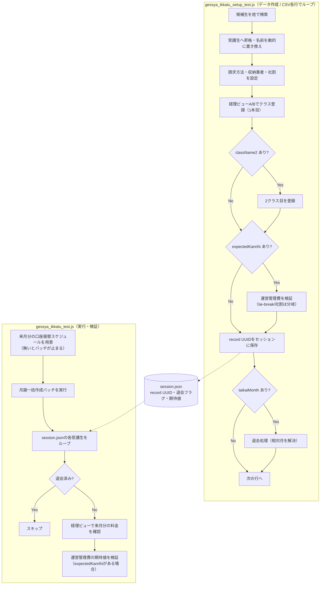

# 月謝一括作成テスト ロジック解説

> - **対象テスト**: `tests/shimamura/flow/gessya_ikkatu_test.js`（本体）＋ `tests/shimamura/flow/gessya_ikkatu_setup_test.js`（準備）
> - **生成日**: 2026-07-07
> - **生成方法**: `/flow-explain` スキル
> - **参照した3点セット**:
>   - テスト本体: `tests/shimamura/flow/gessya_ikkatu_test.js` / `gessya_ikkatu_setup_test.js`
>   - FlowPage: `pages/shimamura/flow/GessyaIkkatuFlowPage.js`（＋ `SyokaiFlowPage.js`）
>   - CSV: `data/shimamura/gessya_ikkatu_setup_data.csv`

---

月謝一括作成画面のバッチを実行し、**登録済みの受講生に対して来月分の月謝料金（運営管理費含む）が正しく作成されるか**を経理ビューで検証するテスト。受講生データの準備（setup）と、バッチ実行・検証（本体）の **2ファイル連携** で成り立つ。

## 全体の流れ

このテストは1本では完結せず、setup が前工程としてデータを作り、本体がそれを消費する構造。両者は画面越しではなく **JSON ファイル経由** でつながっている点がポイント。

```
gessya_ikkatu_setup_test.js  … 受講生を準備（請求方法設定＋クラス登録）
        ↓ output/gessya_ikkatu_session.json（record UUID・退会フラグ・期待値）
gessya_ikkatu_test.js        … 月謝一括作成バッチ実行 → 各受講生の翌月料金を検証
```

- setup 側は `BeforeSuite` で session.json を空配列にリセットしてから、CSV 各行の受講生を作り、その **record UUID** を追記していく。
- 本体側は session.json を読み込み、UUID で受講生詳細に直接遷移して検証する（同名受講生が複数いても取り違えない設計）。

## データソース: `data/shimamura/gessya_ikkatu_setup_data.csv`

1行＝**受講生1人＝1シナリオ**。`Data(csv).Scenario(...)` で全行をループする。列と役割：

| 列 | 役割 | 条件列か |
|---|---|---|
| `lastName` | **既存の候補生**を姓で検索するキー（＝「かげやま」） | |
| `bank_payment_type` / `shima_storage_id` | 請求方法（銀行引落=1 / イオンCカード=2）・収納業者 | |
| `className` / `courseCategory` | 登録クラス・コース区分（スクール/サロン） | |
| `keiyakuDate` / `kaishiDate` | 契約日・開始日 | |
| `className2`〜 | **空欄でなければ**2クラス目を登録（UNN＝掛け持ちパターン） | ✅ |
| `taikaiMonth`（`taikaiYear`） | **空欄でなければ**退会処理（先月/今月/来月を相対指定） | ✅ |
| `expectedKanrihi` / `expectedWinnerClass` / `expectedLoserClass` | **埋まっていれば**運営管理費の最大額確定ロジックを検証 | ✅ |
| `discount` | **`1`なら**社割（運営管理費0円）を設定・検証 | ✅ |

## テストデータ「作成」の実体（ここが肝）

コードを読まないと気づけない“驚きポイント”を先に：

1. **受講生をゼロから新規作成していない** — `lastName`（かげやま）で**既存の候補生**を検索し、「受講生へ移動」で昇格させて流用する。会員番号重複エラーが出た候補生はスキップして次を試し、全滅したら「候補生データを補充してください」と重複チェック用 SQL 付きで停止する。

2. **名前を実行のたびに動的に書き換える** — `月謝テスト{MMDD}` / `{testNo}{scenario}` に上書きし、description に実行日時＋シナリオを残す。同名衝突を避けつつ後で追跡できるようにしている。

3. **日付は過去でも自動補正** — `keiyakuDate`/`kaishiDate` が過去月なら `resolveDynamicDateIfPast` が本日日付に直す。だから CSV の日付を毎月更新しなくてよい。

4. **record UUID をセッションファイルに保存** — 退会フラグや運営管理費の期待値も一緒に書き出し、本体テストへ受け渡す。

**setup 側の条件分岐（CSV 列で処理が増える）：**
- `className2` あり → 経理ビューA/B でもう1クラス登録（2本目）
- `expectedKanrihi` あり → その場（当月）で運営管理費を検証。さらに `expectedLoserClass` もあれば**同額 tie-break** 用の勝者/敗者クラス別検証（未払いバナーの内訳で判定）、なければ通常の最大額検証（社割 `discount=1` なら0円＆社割表示も確認）
- `taikaiMonth` あり → 相対月を解決して退会処理

## 実行と検証（本体側）

- **Act（前提つき）**：`ensureAccountTransferSchedules` で**来月分の口座振替スケジュールを先に用意**する。これが無いとバッチ全体が止まる仕様（#169 の教訓）。その後、月謝作成ボタンを押し、`window.confirm` 承認＋サーバー処理完了（networkidle）まで待つ。
- **Assert**：session.json の各受講生をループ。**退会フラグ付きはスキップ**。それ以外は経理ビューで来月分（YYYY/MM）の料金が表示されることを確認し、`expectedKanrihi`+`expectedWinnerClass` があれば**翌月分にも最大額確定ロジックが効いているか**を運営管理費で再検証する。

## フローチャート


