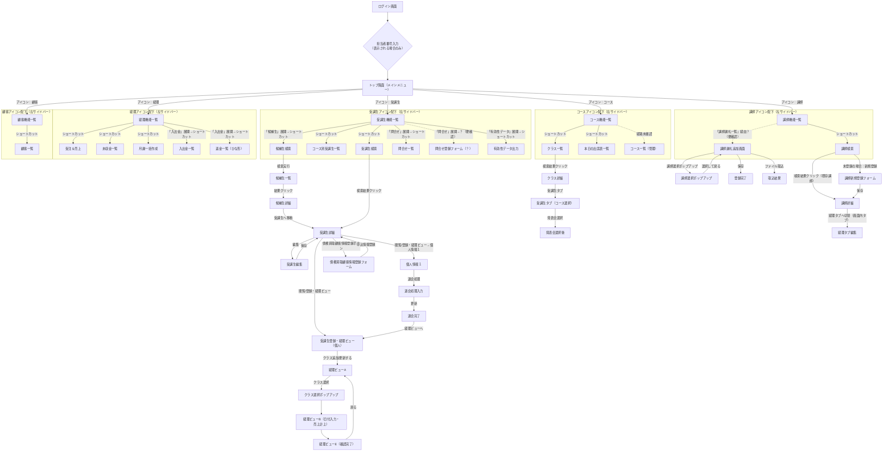

# shimamura 画面遷移図

> 生成日: 2026-07-02
> 生成方法: E2Eテストコード（`pages/shimamura/`, `tests/shimamura/flow/`）を解析して作成
> **範囲の注意**: この図は **一般ユーザーが実際に操作する画面遷移** のみを表しています。
> テストコード内では `SHIMAMURA_NAV` 環境変数に応じて「サイドバー経由」と「URL直遷移」を切り替えられますが、
> この図は常に **トップ画面 → アイコン → （必要なら折りたたみ展開）→ 左サイドバーのショートカット → 画面** という、
> 実際にユーザーがクリックして辿る経路（`pages/shimamura/_common/sideMenus.js` の `moduleUrl` / `collapseToggle` / `shortcut` に対応）で描いています。
> URL直遷移（`directUrl`）はテストの都合上の近道であり、この図には含めていません。

---

## 画面遷移図

**この図の読み方**
- 実線＝ユーザー操作（クリック・保存など）で確定している遷移。点線＝コード上は直URL遷移で確認されていて、実際のアイコン／サイドバー経路が未確認のもの。
- 各「〇〇アイコン配下」の枠は、トップ画面のアイコンをクリックした先の機能一覧画面と、その左サイドバーから直接／折りたたみ展開後に見える画面をまとめたもの。
- 枠の外に出た画面（受講生詳細、経理ビューA/B/Eなど）は、サイドバーではなく画面内のボタン・リンクからさらに移動する範囲。

---

## 要確認（点線部分）

以下は該当機能が **どのアイコン／どのサイドバー項目から辿れるか** をテストコードから断定できなかった箇所です。実際の画面をご存知でしたら教えてください（わかり次第、実線に修正します）。

1. **問合せ登録フォーム** — 「問合せ一覧」と同じ「問合せ」グループの中にショートカットがありますか？
2. **コース一覧（管理・ShimaCourse）** — コースアイコンのサイドバーのどこにありますか？（テストコードは常にURL直遷移で開いているため経路が追えませんでした）
3. **講師謝礼追加画面** — 「講師」アイコン配下ですか、それとも別アイコンですか？
4. **債権買取状態読込画面** — 経理アイコン配下だと思いますが、どのグループ（入出金など）に入っていますか？

---

## 参照元ファイル

| フロー | テストファイル | Page Object |
|---|---|---|
| 受講生登録（新規契約） | `tests/shimamura/flow/syokai_touroku_test.js` | `pages/shimamura/flow/SyokaiFlowPage.js` |
| 退会処理 | `tests/shimamura/flow/taikai_test.js` | `pages/shimamura/flow/SyokaiFlowPage.js`（`ShouldBeOnTaikai`） |
| 月謝一括作成 | `gessya_ikkatu_setup_test.js` / `gessya_ikkatu_test.js` | `pages/shimamura/flow/GessyaIkkatuFlowPage.js` |
| 債権買取顧客情報登録 | `student_saikenkai_test.js` | `pages/shimamura/flow/StudentSaikenkaiFlowPage.js` |
| 講師経理設定 | `teacher_keiri_setup_test.js` | `pages/shimamura/flow/TeacherKeiriFlowPage.js` |
| 講師謝礼追加 | `koushi_sharei_manual_test.js` / `koushi_sharei_tsuika_test.js` | `pages/shimamura/flow/KoushiShareiFlowPage.js` |
| クラス受講生登録 | `shimamura_class_member_registration_test.js` | なし（テスト内に直書き） |
| 問合せ登録 | `contact_register_test.js` | なし（Pattern B・1画面完結） |
| 債権買取状態読込 | `smbc_state_import_test.js` | なし（Pattern B・1画面完結） |
| 経理返金処理 | `keiri_hennkin_syori_test.js` | なし（ひな形・未実装） |
| 画面カタログ（アイコン/サイドバー定義） | — | `pages/shimamura/_common/sideMenus.js` |

## 制約・今後の拡張

- 「要確認」の4項目が判明したら実線に更新する。
- テストが存在しない画面・遷移（管理画面の全機能）はこの図に含まれない。新しいE2Eテストを追加したら、このドキュメントも合わせて更新することを推奨する。
- 経理返金処理（`keiri_hennkin_syori_test.js`）は実装が固まり次第、他フローと同じ粒度に描き直すこと。
