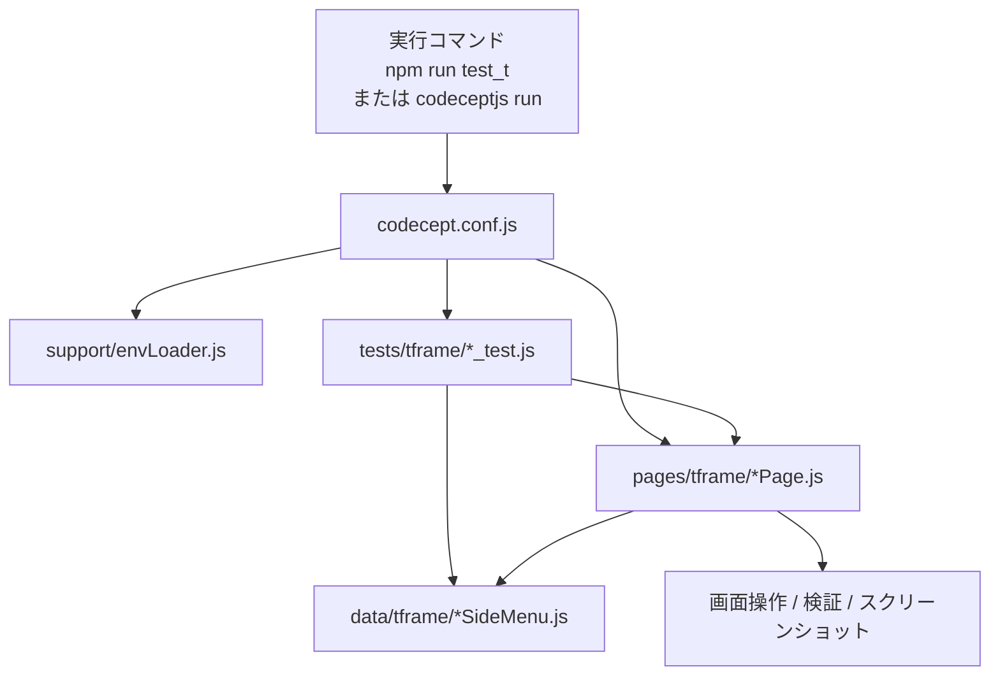
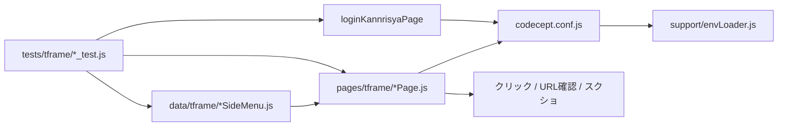

# T-Frame の構成とファイルのつながり

このドキュメントは、`tframe` テストが

- どこから起動されるか
- どのファイルが何を担当するか
- テスト、Page Object、データファイルがどう結びついているか

を、他人に説明できる粒度でまとめたものです。

---

## 全体像

`tframe` は CodeceptJS + Playwright で動いています。

基本の流れは次の通りです。

1. `codecept.conf.js` が読み込まれる
2. `support/envLoader.js` が `.env` と `env/.env.<profile>` を読み込む
3. `tests/tframe/**/*_test.js` がスイートとして実行される
4. テストから `pages/tframe/*Page.js` の Page Object を呼ぶ
5. Page Object が `data/tframe/*SideMenu.js` の定義を使って画面遷移や検証を行う



---

## 起動入口

### 代表的な実行コマンド

- `npm run test_t`
- `npx codeceptjs run ./tests/tframe/**/*_test.js`
- 個別実行例: `npx codeceptjs run ./tests/tframe/page/email_test.js --profile tframe`

### スイート定義

`codecept.conf.js` の `suites.tframe` が `./tests/tframe/**/*_test.js` を拾います。

つまり、`tests/tframe` 配下のサブフォルダを含む全 `*_test.js` が T-Frame の実行対象です。

---

## 設定と初期化

### `support/envLoader.js`

役割:

- ルート `.env` を読む
- `PROFILE` または `--profile` から対象プロファイルを決める
- `env/.env.<profile>` があれば上書きで読む

T-Frame では、ここで読み込まれた環境変数がそのまま使われます。

主に参照される値:

- `LOGIN_TFRAME_URL`
- `TFRAME_LANGUAGE`
- `ADMIN_USER`
- `ADMIN_PASSWORD`
- `BASE_URL`
- `HEADLESS`
- `VIEWPORT_WIDTH` / `VIEWPORT_HEIGHT`（全プロファイル共通。旧名 `TFRAME_VIEWPORT_*` もフォールバックとして読まれる）

### `codecept.conf.js`

役割:

- `tframe` スイートを定義する
- Page Object を `include` に登録する
- Playwright の viewport や windowSize を決める
- Allure や output の保存先を決める

T-Frame で重要なのは次の 2 点です。

1. `include` により `loginKannrisyaPage` などがテストで使える
2. `suites.tframe` により `tests/tframe/*_test.js` が実行対象になる

`include` されている代表的な tframe 用 Page Object は次の通りです。

- `loginKannrisyaPage`
- `apiCommonLoginPage`
- `apiTeacherInfoGetPage`
- `jsonInputPage`
- `loginMyPageTeacher`
- `loginMyPageStudent`
- `keiryoMasterPage`
- `jukuseiPage`
- `coursePage`
- `koshiPage`
- `masterMenuPage`
- `calendarPage`
- `emailPage`
- `reportPage`
- `homePage`
- `helpPage`

---

## テストフォルダの構成

`tests/tframe/` 配下は性質別サブフォルダで管理しています。

| フォルダ | 役割 | 主なファイル |
|---|---|---|
| `auth/` | ログイン・認証系 | login_test, mypage_login_test |
| `page/` | 画面単体の操作・表示確認 | calendar_test, home_test, email_test など |
| `flow/` | 複数画面をまたぐ遷移・シナリオ | navigation_after_login_test |
| `check/` | 表示・設定の確認系（検証寄り） | lang_check_test, dropdown_check_test |
| `api/` | API系 | get_personal_info_api_test |

新規テストを追加するときは、上記の基準で配置先を選んでください。

---

## テストの基本構造

`tests/tframe/**/*_test.js` は、だいたい次の形です。

1. `Feature(...)` で機能単位のまとまりを作る
2. `Scenario(...)` で 1 フローを定義する
3. 先に `loginKannrisyaPage.login(...)` でログインする
4. ログイン成功を `loginKannrisyaPage.seeLogout()` で確認する
5. メニューの Page Object を呼ぶ
6. `data/tframe/*SideMenu.js` の定義に沿って遷移確認する

例:

- `tests/tframe/page/email_test.js`
- `tests/tframe/page/course_test.js`
- `tests/tframe/page/calendar_test.js`
- `tests/tframe/page/help_test.js`
- `tests/tframe/page/jukusei_test.js`
- `tests/tframe/page/keiryo_master_test.js`
- `tests/tframe/page/koshi_test.js`
- `tests/tframe/page/master_menu_test.js`
- `tests/tframe/page/report_test.js`

各テストは、メニューごとに対応する Page Object と data ファイルを組み合わせています。

---

## Page Object の役割

`pages/tframe/*Page.js` は、画面操作をまとめた層です。

共通している考え方は次の通りです。

- メインメニューのアイコンを押す
- サブメニューを順番にたどる
- 画面遷移先の URL を確認する
- 必要なら検索ボタンの有無を見てスクリーンショットを保存する

### 共通パターン

多くのメニュー Page Object には次のようなメソッドがあります。

- `clickXIcon()`
- `verifyMenuNavigation(menuDefinition)`
- `clickMenuItemAndVerify(item)`
- `scrollToHref(href)`
- `clickLinkByHref(href)`
- `assertCurrentUrlMatches(...)`
- `clickSearchIfPresentAndCapture(...)`

ここでのポイントは、**テスト側に画面の細かいセレクタを書かない**ことです。

テストは「何を確認したいか」だけを持ち、実際の操作方法は Page Object に寄せています。

### 例外や個別差分

Page Object ごとに少しずつ違います。

- `EmailPage`
  - `altName` を使う項目がある
  - 任意グループをスキップする処理がある
- `JukuseiPage`
  - `href` がある場合とない場合で、クリック方法を切り替える
- `HelpPage`
  - 直接 `I.amOnPage(item.href)` で遷移する
- `CalendarPage`
  - URL の一致確認を待機付きで行う
- `CoursePage` / `MasterMenuPage` / `ReportPage` / `KeiryoMasterPage` / `KoshiPage`
  - 主に「メニュークリック → URL確認 → スクリーンショット」の流れ

---

## データファイルの役割

`data/tframe/*SideMenu.js` は、メニュー構造をデータとして持つファイルです。

Page Object はここに書かれた定義を見ながら、画面上の項目を順に確認します。

### データの形

基本形は次の通りです。

```js
module.exports = {
  groups: [
    {
      name: 'グループ名',
      items: [
        { name: 'メニュー名', href: '/test/index.php?...' },
      ],
    },
  ],
};
```

使われる主なプロパティ:

- `groups[].name`
- `groups[].items[].name`
- `groups[].items[].href`
- `groups[].items[].altName` 省略可
- `groups[].optional` 省略可

### 代表的な対応関係

- `tests/tframe/page/email_test.js`
  - `pages/tframe/EmailPage.js`
  - `data/tframe/emailSideMenu.js`
- `tests/tframe/page/course_test.js`
  - `pages/tframe/CoursePage.js`
  - `data/tframe/courseSideMenu.js`
- `tests/tframe/page/calendar_test.js`
  - `pages/tframe/CalendarPage.js`
  - `data/tframe/calendarSideMenu.js`
- `tests/tframe/page/help_test.js`
  - `pages/tframe/HelpPage.js`
  - `data/tframe/helpSideMenu.js`
- `tests/tframe/page/jukusei_test.js`
  - `pages/tframe/JukuseiPage.js`
  - `data/tframe/studentSideMenu.js`
- `tests/tframe/page/keiryo_master_test.js`
  - `pages/tframe/KeiryoMasterPage.js`
  - `data/tframe/accountingSideMenu.js`
- `tests/tframe/page/koshi_test.js`
  - `pages/tframe/KoshiPage.js`
  - `data/tframe/teacherSideMenu.js`
- `tests/tframe/page/master_menu_test.js`
  - `pages/tframe/MasterMenuPage.js`
  - `data/tframe/masterSideMenu.js`
- `tests/tframe/page/report_test.js`
  - `pages/tframe/ReportPage.js`
  - `data/tframe/reportSideMenu.js`

---

## ログイン系の流れ

### 管理者ログイン

最初の共通入口は `pages/tframe/LoginKannrisyaPage.js` です。

この Page Object は次を担当します。

- `BASE_URL` へ移動する
- 言語を必要に応じて選ぶ
- 管理者 ID / パスワードを入力する
- ログインボタンを押す
- ログアウト表示で成功確認する

多くの T-Frame テストはここから始まります。

### マイページログイン

`pages/tframe/LoginMyPageTeacher.js` と `pages/tframe/LoginMyPageStudent.js` は、管理者画面とは別のログイン導線です。

`tests/tframe/auth/mypage_login_test.js` で使われ、講師・受講生それぞれのマイページログインとメニュー確認を行います。

### API 補助フロー

T-Frame には、画面遷移だけでなく API 補助の Page Object もあります。

- `pages/tframe/ApiCommonLoginPage.js`
- `pages/tframe/ApiTeacherInfoGetPage.js`
- `pages/tframe/JsonInputPage.js`

これらは、ログイン後に API 実行ページへ進み、レスポンスから `tcnToken` を抜き出す用途で使われます。

---

## 実行フローの例

### 例 1: メニュー遷移テスト

`tests/tframe/email_test.js` の流れ:

1. `loginKannrisyaPage.login(...)`
2. `loginKannrisyaPage.seeLogout()`
3. `emailPage.clickEmailIcon()`
4. `emailPage.verifyMenuNavigation(emailSideMenu)`
5. 各 `groups` / `items` を順番に検証

### 例 2: 選択したメニューを逐次検証

Page Object 内では次のような処理が行われます。

1. メインメニューのアイコンを押す
2. `data/tframe/*.js` からグループと項目を読む
3. 項目ごとにリンクを画面内へスクロールする
4. リンクをクリックする
5. URL が期待値を含むか確認する
6. 必要なら検索ボタンの有無を確認する
7. スクリーンショットを保存する

---

## つながりを一枚で見る



---

## 読み方のコツ

他人に説明するときは、次の順番で話すと伝わりやすいです。

1. `codecept.conf.js` が tframe の入口を決める
2. `support/envLoader.js` が環境変数を読み込む
3. `tests/tframe/*_test.js` がシナリオを定義する
4. `pages/tframe/*Page.js` が画面操作を持つ
5. `data/tframe/*SideMenu.js` がメニューの中身を持つ
6. テストは Page Object と data を組み合わせて、ログイン後の遷移を確認する

この構造を押さえると、個別テストを見ても「どこが入口で、どこが画面操作で、どこがデータか」が追いやすくなります。
